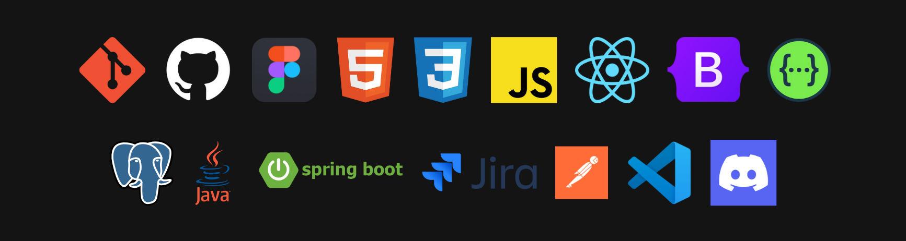

# 
 Neo Horizon - API 5º Semestre - BD 2025
<!--  -->

  <a href="#anger-problema">Problema</a> •
  <a href="#dart-objetivo-do-projeto">Objetivo do Projeto</a> •
  <a href="#requisitos-funcionais-e-nao-funcionais">Requisitos Funcionais e Não Funcionais</a> •
  <a href="#date-backlog-do-produto">Product Backlog</a> •
  <a href="#date-sprint-backlog">Sprint Backlog</a> •
  <a href="#cronograma">Cronograma</a> •
  <a href="#tecnologias-utilizadas">Tecnologias Utilizadas</a>
  <a href="#mortar_board-integrantes-da-equipe">Integrantes da Equipe</a> •

## :anger: Problema 

A Necto, empresa de desenvolvimento de softwares, busca aprimorar a gestão de seus projetos, que atualmente é realizada na plataforma Jira. O principal desafio enfrentado é a falta de visibilidade sobre indicadores, o que dificulta o acompanhamento do progresso e a tomada de decisões estratégicas.

Destaca-se como uma deficiência a falta de um dashboard centralizado para o monitoramento de dados críticos, comprometendo assim a eficiência e a transparência na gestão de projetos. Outro ponto crucial é a necessidade de um controle de acesso mais detalhado, o qual impede uma gestão mais segura e alinhada às responsabilidades de cada nível hierárquico.

## :dart: Objetivo do Projeto

Desenvolver uma aplicação web de inteligência de negócios para gestão de projetos, integrada à base de dados do Jira. Essa ferramenta será um painel de controle centralizado, fornecendo uma visão clara do desempenho dos projetos.

O objetivo da solução é transformar dados brutos em informações estratégicas, capacitando os usuários na tomada de decisões de forma ágil e assertiva.

## Requisitos Funcionais e Não Funcionais

Clique aqui

### Requisitos Funcionais

| ID | Requisito | Descrição |
|:---|:---|:---|
| RF01 | *Painel de Carga de Trabalho Individual* | O sistema deve exibir para o usuário logado uma visão de todos os cards atribuídos a ele, agrupados por projeto. O usuário deve ser capaz de ver a quantidade de cards em cada status, facilitando o acompanhamento do seu progresso pessoal em cada projeto. |
| RF02 | *Relatório de Desempenho do Time* | O sistema deverá permitir que um Líder de Equipe visualize a carga de trabalho de seu time. O relatório deverá exibir o número de cards atribuídos a cada membro e a quantidade de horas utilizadas por eles, com a possibilidade de filtrar por projeto. |
| RF03 | *Painel de Visão Geral do Projeto e Custos* | O sistema deverá exibir para usuários com nível de acesso de "Gerente de Projeto" um painel com a quantidade total de cards por status para um projeto selecionado. O sistema também deverá exibir o tempo médio de ciclo (tempo entre criação e finalização) para as tarefas do projeto, além dos custos do projeto. |
| RF04 | *Relatório de Atividades por Período* | O sistema deverá apresentar um relatório consolidado que exibe a quantidade de cards criados, movidos ou concluídos em períodos pré-definidos (dia, semana, mês ou ano). A visualização deverá permitir a quebra das atividades por desenvolvedor e por projeto. |
| RF05 | *Identificação de Bugs e Retrabalhos* | O sistema deverá identificar e contabilizar a quantidade de cards do tipo "bug". Um relatório com o total de bugs por projeto e por desenvolvedor deverá ser visível para gestores. |
| RF06 | *Sistema de Controle de Acesso* | O sistema deverá implementar três níveis de permissão (Membro de Equipe, Líder de Equipe e Gerente de Projeto) que limitam a visualização dos dados. As permissões deverão ser aplicadas em todos os painéis e relatórios, garantindo que cada usuário visualize apenas as informações pertinentes às suas responsabilidades e aos projetos que ele gerencia. |
| RF07 | Relatório de Horas por Módulo | O sistema deverá disponibilizar um relatório que apresente a quantidade de horas registradas nos módulos Épico, Produto e Entregável. O objetivo é permitir que o usuário tenha acesso a essas informações de forma clara e organizada, apoiando a análise de esforço e acompanhamento do progresso dos projetos. |

### Requisitos Não Funcionais

| ID | Requisito | Descrição |
|:---|:---|:---|
| RNF01 | *Documentação Técnica* | A API desenvolvida para se conectar com o Jira deverá ser documentada de forma clara, utilizando ferramentas padrão da indústria, como o Swagger. A documentação deve incluir os endpoints, métodos, parâmetros e exemplos de requisições. |
| RNF02 | *Usabilidade* | A interface do usuário deve ser intuitiva e limpa, garantindo uma boa experiência de uso para todos os perfis (Membro de Equipe, Líder e Gerente). |
| RNF03 | *Modelagem do Banco de Dados* | O sistema deverá contar com uma modelagem de banco de dados relacional otimizada, garantindo integridade referencial, desempenho nas consultas e escalabilidade. A modelagem deverá considerar normalização, chaves estrangeiras, índices e histórico de movimentações dos cards para o cálculo de indicadores como tempo de execução e retrabalho. |

## :date: Backlog do Produto

Clique aqui

| ID | Rank | Prioridade | User Story | Sprint | Requisitos Relacionados |
|:---|:---|:---|:---|:---|:---|
| US01 | 1 | Alta | Como Gerente de Projeto, desejo visualizar todas as métricas disponibilizadas em cards, para acompanhar de forma prática os dados e indicadores de desempenho do projeto. | 1 | RF04 |
| US02 | 2 | Alta | Como Gerente de Projeto, desejo visualizar a quantidade de cards para que eu tenha uma visão estratégica do projeto. | 1 | RF02 |
| US03 | 3 | Alta | Como Gerente de Projeto, desejo analisar os custos consolidados dos projetos, para controlar melhor os recursos e alinhar os investimentos com os objetivos estratégicos da empresa. | 1 | RF03 |
| US04 | 4 | Alta | Como Gerente de Projeto, preciso ter visibilidade sobre o tempo gasto de ciclo das tarefas, para avaliar a eficiência das entregas e apoiar a tomada de decisões de melhoria no processo. | 1 | RF04 |
| US05 | 5 | Média |Como Gerente de Projeto, desejo visualizar a quantidade de horas utilizadas por cada desenvolvedor, detalhadas por atividade e por dia, para acompanhar a distribuição do esforço da equipe e identificar oportunidades de otimização na alocação de recursos. | 2 | RF02 |
| US06 | 6 | Média | Como Gerente de Projeto, desejo metrificar a quantidade de atividades relacionadas à correção de bugs para gerenciar qualidade e reduzir retrabalhos. | 2 | RF05 |
| US07 | 7 | Média | Como Gerente de Projeto, desejo informar de forma dinâmica o custo por hora dos desenvolvedores para analisar assertivamente métricas orçamentárias. | 2 | RF03 |
| US08 | 8 | Média | Como Gerente de Projeto, desejo realizar filtros dos dados exibidos por projeto para construir vistas dinâmicas. | 2 | RF01 |
| US10 | 9 | Baixa | Como Líder de Equipe, desejo visualizar a carga de trabalho do meu time (número de cards e horas por membro), para que eu possa acompanhar o desempenho da equipe. | 3 | RF02 |
| US09 | 10 | Baixa | Como usuário, desejo realizar autenticação com meu usuário e senha, para garantir segurança aos dados sensíveis. | 3 | RF06 |
| US11 | 11 | Baixa | Como usuário, quero acessar um relatório com as métricas dos cards do tipo bug, permitindo identificar e acompanhar os retrabalhos nos projetos. | 3 | RF05, RF07 |
| US12 | 12 | Baixa | Como Gerente de Projeto, quero acompanhar a distribuição dos cards por status (em andamento, concluídos, pendentes etc.), a fim de monitorar o progresso e identificar possíveis gargalos no fluxo de trabalho. | 3 | RF06 |

## :date: Sprint Backlog

Sprint 1

Proposta de entrega:
Tela inicial (sem validação de acesso do usuário), contendo os seguintes gráficos consumindo dados do cliente:
- Total de Issues
- Análise de custo (geral e por projeto)
- Quantidade de atividades realizadas dentro do período (dia, mês, ano)
- Quantidade de horas utilizadas por desenvolvedor, detalhadas por atividade e por dias

| ID | Rank | Prioridade na Sprint | User Story | Requisitos Relacionados |
|:---|:---|:---|:---|:---|
| US01 | 1 | Alta | Como Gerente de Projeto, desejo visualizar todas as métricas disponibilizadas em cards, para acompanhar de forma prática os dados e indicadores de desempenho do projeto. | RF04 |
| US02 | 2 | Média | Como Gerente de Projeto, desejo visualizar a quantidade de cards para que eu tenha uma visão estratégica do projeto. | RF02 |
| US03 | 3 | Média | Como Gerente de Projeto, desejo analisar os custos consolidados dos projetos, para controlar melhor os recursos e alinhar os investimentos com os objetivos estratégicos da empresa. | RF03 |
| US04 | 4 | Média | Como Gerente de Projeto, preciso ter visibilidade sobre o tempo gasto de ciclo das tarefas, para avaliar a eficiência das entregas e apoiar a tomada de decisões de melhoria no processo. | RF04 |

Sprint 2

| ID | Rank | Prioridade na Sprint | User Story | Requisitos Relacionados |
|:---|:---|:---|:---|:---|
| TT02 | 1 | Alta | Refatorar modelo de banco alinhado ao ETL e cadastro de valor hora dev e documentação de processos de DevOps | RF04 |
| US05 | 3 | Alta |Como Gerente de Projeto, desejo visualizar a quantidade de horas utilizadas por cada desenvolvedor, detalhadas por atividade e por dia, para acompanhar a distribuição do esforço da equipe e identificar oportunidades de otimização na alocação de recursos. | RF02 |
| US06 | 4 | Média | Como Gerente de Projeto, desejo metrificar a quantidade de atividades relacionadas à correção de bugs para gerenciar qualidade e reduzir retrabalhos. | RF01 |
| US07 | 5 | Média | Como Gerente de Projeto, desejo informar de forma dinâmica o custo por hora dos desenvolvedores para analisar assertivamente métricas orçamentárias. | RF01 |
| US08 | 6 | Baixa | Como Gerente de Projeto, desejo realizar filtros dos dados exibidos por projeto para construir vistas dinâmicas. | RF01 |

Sprint 3

<!-- | ID | Rank | Prioridade na Sprint | User Story | Requisitos Relacionados |
|:---|:---|:---|:---|:---|
| US08 | 8 | Alta | Como usuário, desejo realizar autenticação com meu usuário e senha, para garantir segurança aos dados sensíveis. | RF06 |
| US09 | 9 | Alta | Como usuário, quero acessar um relatório com as métricas dos cards do tipo bug, permitindo identificar e acompanhar os retrabalhos nos projetos. | RF05 |
| US10 | 10 | Alta | Como Gerente de Projeto, quero acompanhar a distribuição dos cards por status (em andamento, concluídos, pendentes etc.), a fim de monitorar o progresso e identificar possíveis gargalos no fluxo de trabalho. | RF06 | -->

 

## :calendar: <a id="cronograma"> Cronograma 📅 </a>

| Sprint  | Nome | Data inicio  | Data Fim | Status |
| --- | -------------------------- | --------| ----- | --- |
| --  | KickOff                    | 25/08   | 29/08 |  X  |
|  1  | Sprint 1                   | 08/09   | 28/09 |  X  |
|  2  | Sprint review / Planning   | 29/09   | 03/10 |  X  |
|  3  | Sprint 2                   | 06/10   | 26/10 |     |
|  4  | Sprint review / Planning   | 27/10   | 31/10 |     |
|  5  | Sprint 3                   | 03/11   | 23/11 |     |
|  6  | Sprint review              | 24/11   | 28/11 |     |
|  7  | Feira de Soluções          | 04/12   |       |     |

 

## :mortar_board: Integrantes da Equipe:

| *Nome*                   | *Função*            | *LinkedIn*                                                  |
|:------------------:|:-----------------:|:----------------------------------------------------------:|
| Elbert Jean        | Product Owner     |  |
| Gabriel Souza      | Scrum Master  |  |
| Alexandre Jonas | Developer     |  |
| César Truyts       | Developer |  |
| Elbert Jean        | Developer     |  |
| Gustavo Robert     | Developer     |  |
| Pablo Henrique     | Developer     |  |
| Vitor Morais       | Developer     |  |

 

## Tecnologias Utilizadas

